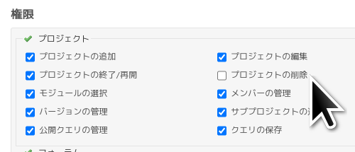
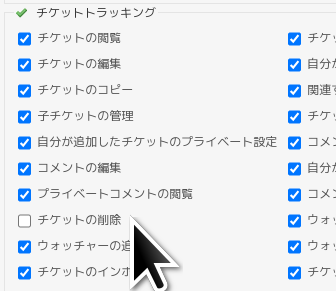
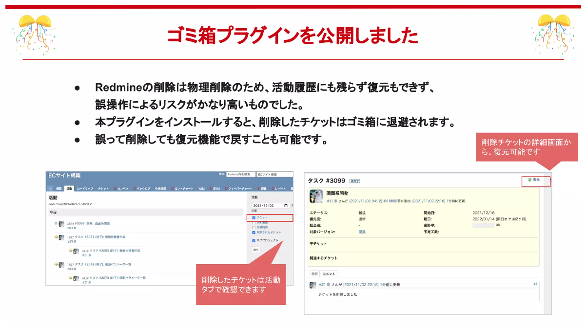
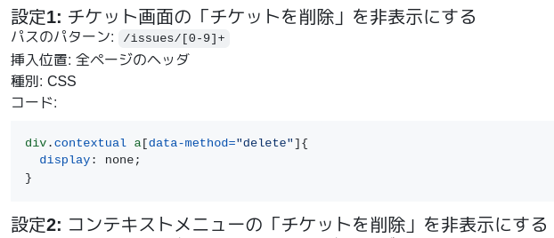
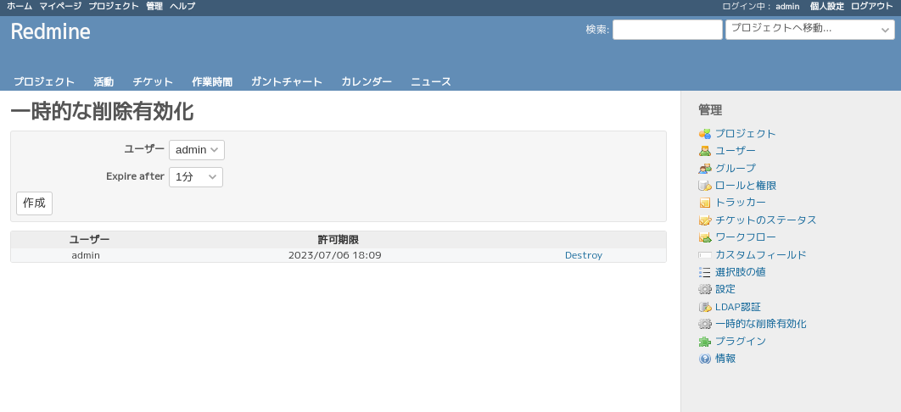

# 削除操作 しない させない ゆるさない

author
: 西田雄也
  ネットワーク応用通信研究所
  2023-07-07

allotted-time
: 10m

theme
: lightning-simple

# 自己　紹介

# 自己紹介

- 西田雄也 ネットワーク応用通信研究所
- Ruby City MATSUE（島根県）から参りました！
- GitHub: [https://github.com/nishidayuya](https://github.com/nishidayuya)
- Twitter: [https://twitter.com/nishidayuya](https://twitter.com/nishidayuya)
- 趣味ではなにかツールを作っています．
    - dpu: Git作業ディレクトリ上のパスを指定するとタグあるいはコミットIDを用いたGitHub.com上で参照可能なURIを生成する．
    - 2023-09-16の松江Ruby会議10でしゃべります．

# 削除操作のお話

# 削除操作のお話

- Redmineでの各種削除操作
    - ユーザーの削除
    - プロジェクトの削除
    - Issueの削除
    - Issueのコメントの削除
    - Issueのウォッチャーの削除
    - Wikiページの削除
    - フォーラムの削除
    - フォーラムのメッセージの削除
    - ...

# 削除すると

- （あたりまえですが）削除したものは残らない
- 履歴にも残さない
- Redmine標準では復活させる機能はない

↓

削除前に警告される．

しかしながら，気がつくのは大抵削除した後...

↓

ではどうするか？

# 削除操作 しない！

# 削除操作 しない！

いくつかは代わりの手段がある．

- ユーザー: 「ロック」すればいい．ログインできなくなる．
- プロジェクト: 「アーカイブ」すればいい．
  プロジェクト一覧やプロジェクト選択肢にあらわれなくなる．
- Issue: ステータスを「却下」のような
  「終了したチケット」フラグがオンのものにすればいい．

これらの手段なら画面上から簡単に復活できる．

# 削除はしなくていいけれど

- 「チケットを削除」見えると使いたくなってしまう．
- 疲れているときとか忘れて削除しちゃうかもしれない．
- 削除しなくていいことを共有してなかったメンバーは？

↓

ではどうするか？

# 削除操作 させない！

# 削除操作 させない！

4つの方法

1. ロールで削除の権限を落とす
2. ゴミ箱プラグインを使う
3. View customizeプラグインで非表示化する
4. 削除させないためのプラグイン

# 1. ロールで削除の権限を落とす

{:relative_height='50'}

{:relative_height='110'}

# 2. ゴミ箱プラグインを使う

- アジャイルウェアさんのゴミ箱プラグイン
- [https://github.com/agileware-jp/redmine_issue_trash](https://github.com/agileware-jp/redmine_issue_trash)
- Issueについてのみ扱う．
- 削除せずにゴミ箱に入ったように見える．
    - Issueのbefore_destroyで削除しようとするIssueのコピーを別テーブルに保持する．
- 復活できる！

# 2. ゴミ箱プラグインを使う

{:relative_height='80'}

- [https://www.slideshare.net/agileware_jp/lychee-redminelychee](https://www.slideshare.net/agileware_jp/lychee-redminelychee) より引用

# 3. View customizeプラグインで非表示化する

- onozatyさんのView customizeプラグイン
- [https://github.com/onozaty/redmine-view-customize](https://github.com/onozaty/redmine-view-customize)
- ファーエンドテクノロジーさんの「View customizeプラグインによるRedmineカスタマイズ集」の「システム管理者権限ユーザーでログインした際にチケット削除ボタンを非表示にする」が良さそう．

# 3. View customizeプラグイン

{:relative_height='65'}

- [https://github.com/farend/redmine-view-customize-examples/blob/3e7c90f744771d797bbcfb7485682f99be81076e/customizes/27afbc24/customize.md](https://github.com/farend/redmine-view-customize-examples/blob/3e7c90f744771d797bbcfb7485682f99be81076e/customizes/27afbc24/customize.md)より引用

# 4. 削除させないためのプラグイン

# 今日のために

# 作ってきました

# 　全米が　　泣いた（嘘）

# そのプラグインの名は...

# そのプラグインの名は...

Redmine

{:relative_height='90'}

# そのプラグインの名は...

Redmine

# 邦題

# 絶対削除させないマン

# デモ

# Redmine The NeverDeleting Story a.k.a. 絶対削除させないマン

- 削除させない
    - プロジェクト
    - ユーザー
    - Issue
- システム管理者であろうとも

# 絶対削除させないマン

- 一時的に削除を許す優しい一面もある

{:relative_height='90'}

# 本気モード 絶対削除させないマン

- 環境変数 `RTNDS_FULL_POWER=1` を設定する．

↓

- destroyメソッドやdeleteメソッドなど，
  削除に関連するメソッドをundef_method
- Rakeタスクやrails consoleによる実行でも削除させない

# 今後

# 絶対削除させないマン今後 (1)

- 急いで作ったので... :>
- ごく直近について
    - README.md ちゃんと書こう
    - i18n
        - 日本語メッセージ
        - 英語メッセージ
    - 自動試験＆CI
    - 管理画面も削除リンク非表示

# 絶対削除させないマン今後 (2)

- さらに後ほど
- Rubyが目指している型宣言を書かずに
  型の恩恵を享受する未来
- Redmineプラグインでも活用できないだろうか．
- パイロットアプリケーションとして利用
    - 既存のメソッド置換え
    - モデルがある
    - コントローラとビューがある

# まとめ

- 削除操作
- しない: 「ロック」「アーカイブ」「却下」でいいんです
- させない: 4つの方法
    - ロールで削除の権限を落とす
    - ゴミ箱プラグインを使う
    - View customizeプラグインで非表示化する
    - 絶対削除させないマン
- ゆるさない: ．．．

# まとめ

- 削除操作
- しない: 「ロック」「アーカイブ」「却下」でいいんです
- させない: 4つの方法
    - ロールで削除の権限を落とす
    - ゴミ箱プラグインを使う
    - View customizeプラグインで非表示化する
    - 絶対削除させないマン
- ゆるさない: 権限と絶対削除させないマンが403にします

# ご静聴ありがとうございました

Redmine

{:relative_height="47" :align="right" :relative_margin_right="-5"}

a.k.a. 絶対削除させないマン プラグイン

[https://github.com/nishidayuya/redmine_the_never_deleting_story](https://github.com/nishidayuya/redmine_the_never_deleting_story)

Starはこちら↑
